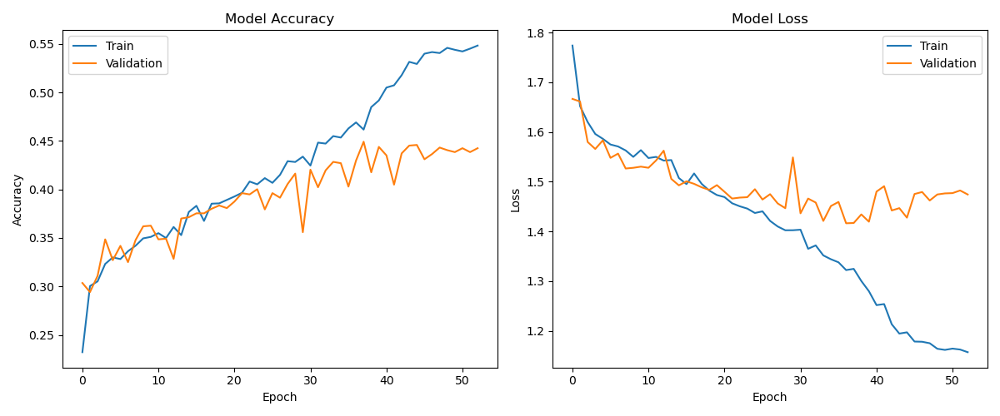
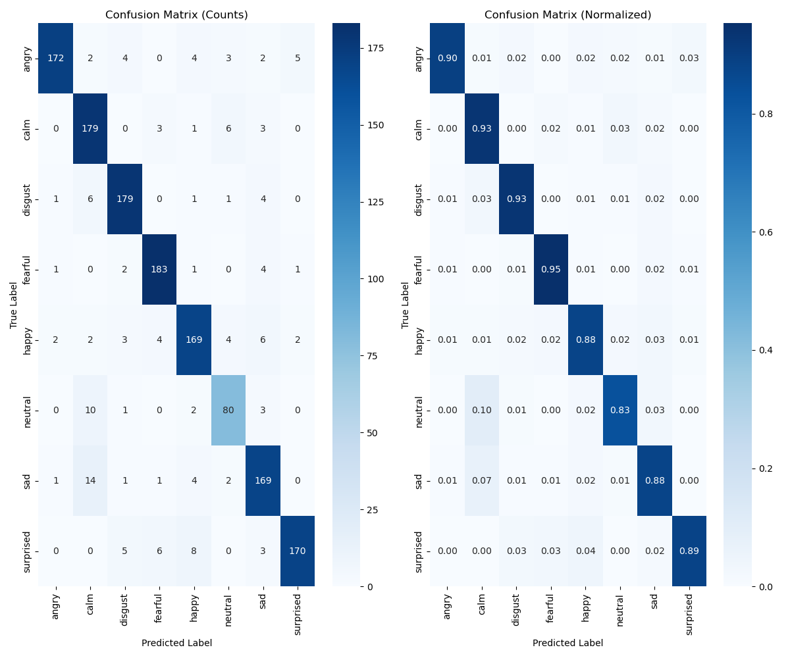
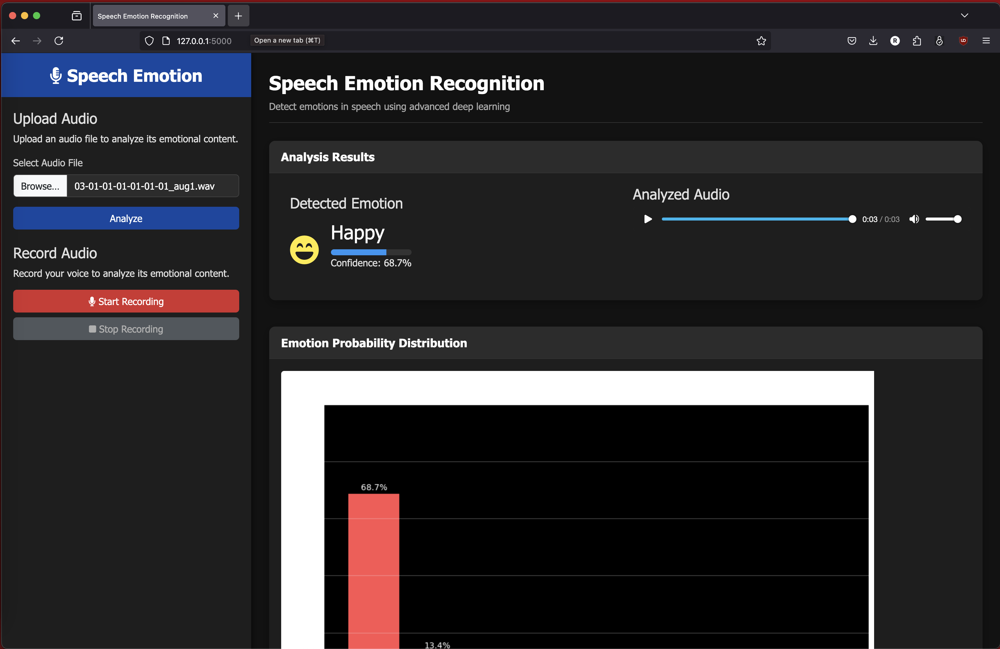

# Speech Emotion Recognition (SER) Project

This project implements a Speech Emotion Recognition system using a Convolutional Neural Network (CNN) to classify emotions from audio inputs. The system can recognize eight different emotions: angry, calm, disgust, fearful, happy, neutral, sad, and surprised.

## Project Overview

The Speech Emotion Recognition (SER) system is built using Python and TensorFlow/Keras. It utilizes the RAVDESS dataset for training and evaluation. The system features a web-based interface for real-time emotion detection from audio inputs.

## Features

- Emotion classification using deep learning (CNN architecture)
- Web-based user interface with Flask
- Real-time audio processing and emotion detection
- Support for multiple emotions: angry, calm, disgust, fearful, happy, neutral, sad, and surprised
- Training visualization and performance metrics
- Cross-validation for model evaluation

## Project Structure

```
speech-emotion-recognition/
├── app.py               # Flask application server
├── improved_cnn.py      # CNN model implementation
├── requirements.txt     # Project dependencies
├── static/
│   ├── css/
│   │   └── style.css   # Frontend styling
│   ├── js/
│   │   └── script.js   # Frontend JavaScript
│   ├── uploads/        # Directory for uploaded audio files
│   └── app_screenshot.png  # Application screenshot
├── templates/
│   └── index.html      # Web interface template
└── data/               # Dataset directory
```

## Installation

1. Clone the repository:
```bash
git clone https://github.com/BeestRatish/SAR-Project.git
cd SAR-Project
```

2. Create a virtual environment (recommended):
```bash
python -m venv venv
source venv/bin/activate  # On Windows: venv\Scripts\activate
```

3. Install dependencies:
```bash
pip install -r requirements.txt
```

## Usage

1. Start the Flask application:
```bash
python app.py
```

2. Open your web browser and navigate to `http://localhost:5000`

3. Upload an audio file or use the microphone to record audio for emotion detection

## Model Performance

The CNN model achieves excellent performance metrics:

### Test Set Performance
- **Test Accuracy**: 92.85%
- **Test Loss**: 0.3870
- **Macro Precision**: 92.62%
- **Macro Recall**: 92.84%
- **Macro F1 Score**: 92.70%

### Cross-Validation Results
- **Mean CV Accuracy**: 90.38%
- **Standard Deviation**: 0.0095
- **CV Scores**: [0.9141, 0.8880, 0.9123, 0.8993, 0.9054]

### Per-Class Performance
| Emotion    | Precision | Recall | F1 Score | Support |
|------------|-----------|--------|----------|---------|
| angry      | 0.99      | 0.95   | 0.97     | 192     |
| calm       | 0.92      | 0.95   | 0.93     | 192     |
| disgust    | 0.92      | 0.92   | 0.92     | 192     |
| fearful    | 0.93      | 0.95   | 0.94     | 192     |
| happy      | 0.94      | 0.89   | 0.91     | 192     |
| neutral    | 0.88      | 0.93   | 0.90     | 96      |
| sad        | 0.90      | 0.91   | 0.91     | 192     |
| surprised  | 0.93      | 0.93   | 0.93     | 192     |

**Overall Accuracy**: 93%
**Macro Average**: Precision: 0.93, Recall: 0.93, F1 Score: 0.93
**Weighted Average**: Precision: 0.93, Recall: 0.93, F1 Score: 0.93

## Visualizations

### Training History


### Confusion Matrix


### Application Interface


## Technical Details

- **Model Architecture**: 1D CNN with multiple convolutional layers
- **Features Extracted**: MFCC, Chroma, and Mel Spectrogram features
- **Dataset**: RAVDESS (Toronto emotional speech dataset)
- **Preprocessing**: Audio normalization and feature extraction
- **Training**: 5-fold cross-validation with early stopping

## Requirements

- Python 3.8+
- TensorFlow 2.8.0
- Flask 2.0.1
- Librosa 0.9.1
- Other dependencies listed in [requirements.txt](requirements.txt)

## Contributing

1. Fork the repository
2. Create your feature branch (`git checkout -b feature/AmazingFeature`)
3. Commit your changes (`git commit -m 'Add some AmazingFeature'`)
4. Push to the branch (`git push origin feature/AmazingFeature`)
5. Open a Pull Request

## License

This project is licensed under the MIT License - see the LICENSE file for details.

## Acknowledgments

- RAVDESS dataset for training and evaluation
- TensorFlow/Keras for deep learning implementation
- Flask for web application framework
